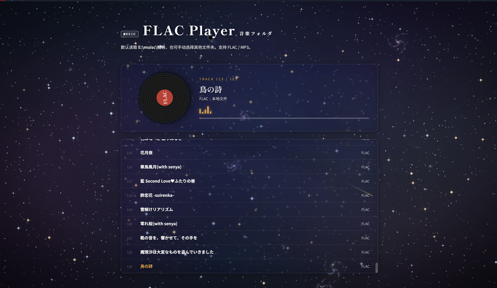

# Angel Player · 带星空的音乐播放器

> A music player with a deep space starfield background.
> 
> 一个带有深空星野背景的音乐播放器。

---

## 简介

Angel Player 是一个基于 Tauri + 纯 HTML/CSS/JavaScript 的音乐播放器。
支持 FLAC / MP3 播放，背景是实时渲染的深空星野，包含动态星云、螺旋星系、
流星、黑洞和引力透镜效果。播放器 UI 使用超透液态玻璃质感，与星空融为一体。

---

## 特性

### 音乐播放

- 🎵 支持 FLAC / MP3
- 📂 浏览器端手动选择文件夹
- 🖥️ 桌面端自动读取本地目录
- ⏯️ 播放 / 暂停 / 上一首 / 下一首
- 📊 实时进度条
- 💿 旋转光盘动画
- 🎚️ 音频频谱动画

### 深空星野

- 🌌 动态多色星云
- 🌀 螺旋星系（星璇）
- ✨ 银河带
- 🌠 流星
- 🕳️ 黑洞 + 引力透镜
- 🪐 土星环星
- 💫 鼠标星尘

### UI 与交互

- 💎 超透液态玻璃卡片
- 🌟 星际尘埃跟随鼠标
- 🎨 深空冷色调配色
- 🖱️ 星空视差效果

---

## 快速开始

### 桌面端（Tauri）

需要先安装：

- [Rust](https://www.rust-lang.org/tools/install)
- [Tauri CLI](https://tauri.app/v1/guides/getting-started/setup)

```bash
git clone https://github.com/Pokemon-Rayquaza/angel-player.git
cd angel-player
cargo tauri dev
```

打包：

```bash
cargo tauri build
```

生成的安装包在 `src-tauri/target/release/bundle/`。

### 浏览器端

直接用浏览器打开 `src/index.html`。

> 注意：浏览器端无法读取固定路径，只能手动选择音乐文件夹。

---

## 自定义默认音乐目录

桌面端默认读取用户音乐目录下的 `Music` 文件夹。
可以通过环境变量 `ANGEL_PLAYER_MUSIC_DIR` 指定：

```bash
# Windows
set ANGEL_PLAYER_MUSIC_DIR=E:\muisc\倾听
cargo tauri dev

# macOS / Linux
export ANGEL_PLAYER_MUSIC_DIR=~/Music
cargo tauri dev
```

---

## 目录结构

```
angel-player/
├── src/
│   └── index.html          # 主页面（含星空背景 + 播放器）
├── src-tauri/
│   ├── Cargo.toml          # Rust 项目配置
│   ├── Cargo.lock
│   ├── build.rs
│   ├── tauri.conf.json     # Tauri 配置
│   ├── icons/              # 应用图标
│   └── src/
│       ├── main.rs         # Tauri 入口
│       └── commands.rs     # 后端命令
├── README.md
├── LICENSE
└── .gitignore
```

---

## 技术栈

- **HTML / CSS / JavaScript** —— 无框架，纯原生
- **Canvas 2D** —— 星空背景实时渲染
- **Simplex Noise + fbm** —— 星云纹理生成
- **Tauri** —— 桌面端

---

## 浏览器兼容性

| 浏览器 | 支持 |
|---|---|
| Chrome / Edge | ✅ 完整支持 |
| Firefox | ✅ 完整支持 |
| Safari | ✅ 支持（需要 `-webkit-backdrop-filter`） |
| 移动端 | ⚠️ 部分支持（性能可能受限） |

需要 `backdrop-filter` 支持，IE 不支持。

---

## 常见问题

### 1. 为什么浏览器里选文件夹没有反应？

浏览器出于安全限制，无法读取固定路径。请使用桌面版（Tauri），或手动点击「选择音乐文件夹」。

### 2. 为什么音乐播放不了？

- 检查文件格式是否为 FLAC / MP3
- 浏览器端某些格式可能不支持
- 桌面端检查路径是否正确

### 3. 星空动画卡顿？

- 降低 `P.density`（减少星星数量）
- 关闭星云闪现
- 在 `prefers-reduced-motion` 下会自动减少动画

---

## 贡献

欢迎提交 Issue 和 Pull Request。

1. Fork 本仓库
2. 创建你的分支：`git checkout -b feature/AmazingFeature`
3. 提交改动：`git commit -m 'Add some AmazingFeature'`
4. 推送：`git push origin feature/AmazingFeature`
5. 提交 Pull Request

---

## License

MIT © [Pokemon-Rayquaza](https://github.com/Pokemon-Rayquaza)
